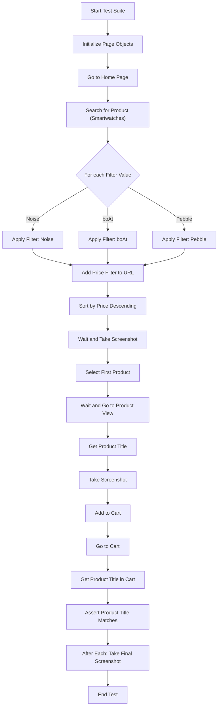

# Paylocity Assignment: Data-Driven Playwright Test Suite

## Overview
This project contains Playwright end-to-end tests for product search and cart functionality. The tests are data-driven, running for each filter value (e.g., Noise, boAt, Pebble) to ensure robust coverage of product filtering and cart operations.
## Execution Flow


## Local Test RUN (Traces)


## Test Reports View


## Test Artefacts Capture Under GitHub Actions 


## Test Flow
The following flowchart illustrates how the tests are executed:



## How to Add New Filter Values
To run the test for additional product filters, simply update the `filterValues` array in `tests/product_search.spec.ts`:

```
const filterValues = ['Noise', 'boAt', 'Pebble', 'NewBrand'];
```

The test will automatically run for each value in the array.

## Running the Tests
1. Install dependencies:
   ```
   npm install
   ```
2. Run the tests:
   ```
   npx playwright test
   ```

## Project Structure
- `tests/product_search.spec.ts`: Main data-driven test file
- `page_objects/`: Page Object Model files for each page
- `utils/`: Utility functions (e.g., screenshot attachment)

---

For more details, see the code and comments in each file. 
